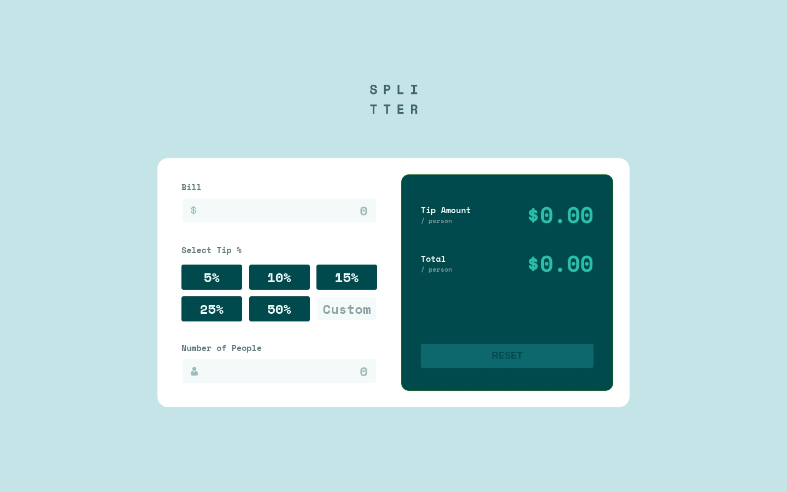
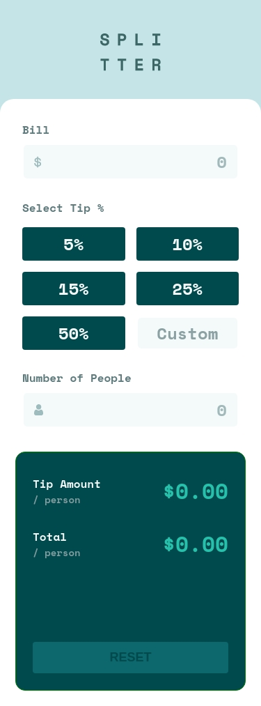

# Frontend Mentor - Tip calculator app solution

This is a solution to the [Tip calculator app challenge on Frontend Mentor](https://www.frontendmentor.io/challenges/tip-calculator-app-ugJNGbJUX). Frontend Mentor challenges help you improve your coding skills by building realistic projects.

## Table of contents

- [Overview](#overview)
  - [The challenge](#the-challenge)
  - [Screenshot](#screenshot)
  - [Links](#links)
- [My process](#my-process)
  - [Built with](#built-with)
  - [What I learned](#what-i-learned)
  - [Continued development](#continued-development)
  - [Useful resources](#useful-resources)
- [Author](#author)
- [Acknowledgments](#acknowledgments)

**Note: Delete this note and update the table of contents based on what sections you keep.**

## Overview

### The challenge

Users should be able to:

- View the optimal layout for the app depending on their device's screen size
- See hover states for all interactive elements on the page
- Calculate the correct tip and total cost of the bill per person

### Screenshot




### Links

- Solution URL: [CODE](https://github.com/Jimender/tip-calculator)
- Live Site URL: [LIVE](https://jimender.github.io/tip-calculator/)

## My process

### Built with

- Semantic HTML5 markup
- CSS custom properties
- Flexbox
- CSS Grid
- Vanilla JS

### What I learned

This Challenge helped me in improving my skills. I learned about regex and `@media (hover:hover)`through this challenge

`regex`

```JS
const numberRegex = /^\s*[+-]?(\d+|\.\d+|\d+\.\d+|\d+\.)(e[+-]?\d+)?\s*$/; //NUMBER VALIDATION
```

`@media (hover:hover)`

```CSS
@media (hover: hover) {
  &:hover {
    background-color: $color-primary-button-hover;
    color: $color-primary-button;
  }
}
```

### Continued development

Continued learning regex trying to fully master it.

### Useful resources

- [CSS Grid](https://learncssgrid.com/)

## Author

- Frontend Mentor - [@Jimender](https://www.frontendmentor.io/profile/Jimender)

## Acknowledgments

Thanks to [@ChamuMutezva](https://www.frontendmentor.io/profile/ChamuMutezva) for help in regex code.
